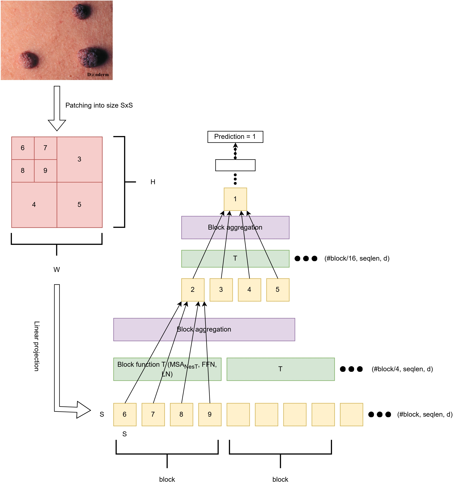
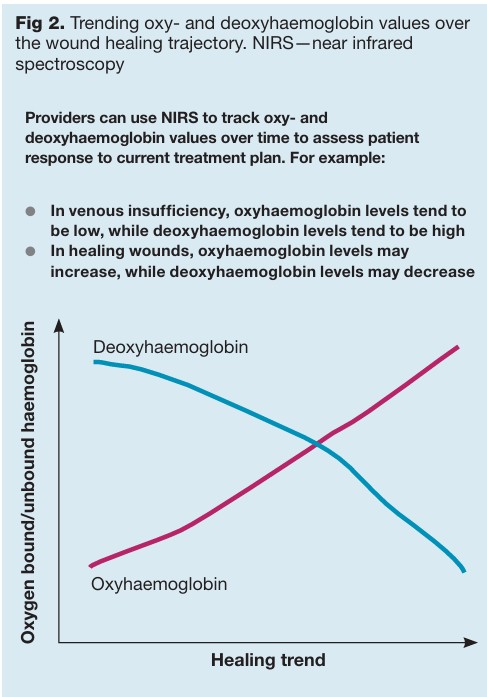
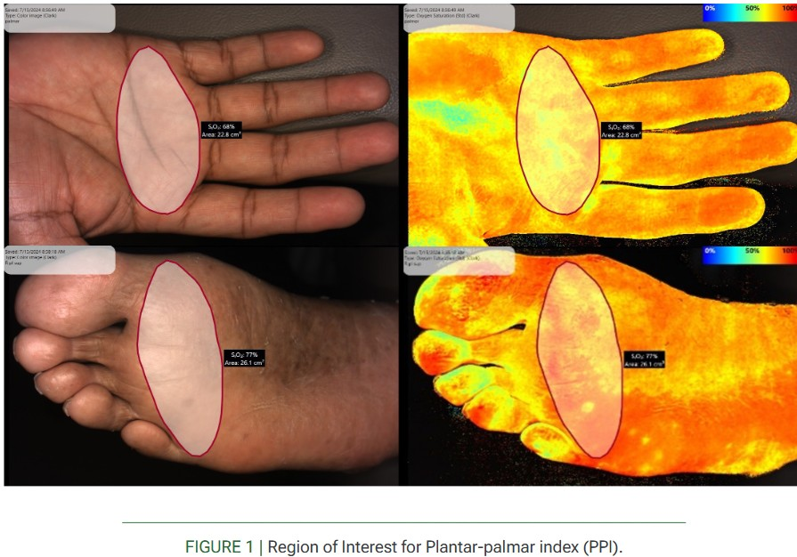
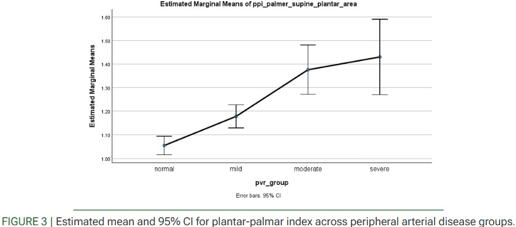

# Portfolio
---
## Medical Image Analysis + Computer Vision

### AI-assisted mole detection for online dermatology triage in telemedicine settings

Implementation of the research project for my Master's in Radiology and Diagnostic Imaging from the University of Alberta. Please feel free to take a look at my thesis here:[https://doi.org/10.7939/r3-yhtz-p450](https://doi.org/10.7939/r3-yhtz-p450) !

This study proposes a triaging system that enables early identification of skin moles to ease the follow-up treatment and diagnostic procedures in a physical setting. A comparative evaluation of the prediction performance of the Nested Hierarchical Transformer (NesT) against state-of-the-art competitors on images acquired from both clinical visits as well as the publicly available DANDERM dataset has been presented. Multiple experiments across different models yielded a macro average recall value as high as 0.955, along with overall accuracy and macro average precision values of 0.962 and 0.958, respectively.

Paper: The findings of this study were published in the journal, Informatics in Medicine Unlocked (2023). Please feel free to take a look at it here: [https://doi.org/10.1016/j.imu.2023.101311](https://doi.org/10.1016/j.imu.2023.101311)!

 

 

---

### Evaluation of Retinal Vessel Segmentation with Dark Channel Prior dehazing (CMPUT 610 course project)

This project studies the effect of a dehazing technique based on dark channel prior (DCP) along with other traditional techniques on different state-of-art deep learning models for retinal vessel segmentation. The DRIVE dataset has been chosen for this project as it is the most widely used and popular benchmark dataset for retinal vessel segmentation.
 

While using modern cameras for retinal image acquisition, there often occurs some reflections from the retinal surface that causes luminosity and contrast variations. These irregularities in illumination might introduce distortions in the acquired image thereby distorting the anatomical structures. So, the illumination correction proposed by Savelli et. al, which draws a connection between shadows and haze, is used to reduce these illumination defects in this project. Since the performance of this method had only been tested on older retinal vessel segmentation algorithms, we attempt to utilize the results obtained from this method to train modern vessel segmentation networks and compare their performances.

 

 

---

### Automatic Segmentation of Hepatocellular Carcinoma Based on Deep Learning and Convolutional Neural Networks (Mitacs GRI: University of Guelph)

 This project implements an end-to-end U-Net segmentation framework for cancerous tissues from Whole Slide Histopathology Images (WSI) of liver. The liver is often associated with metastatic spread of cancer. 90% of primary liver cancer is represented by Hepatocellular Carcinoma (HCC) and it is amongst the leading sources of cancer mortality globally. Successful segmentation of the viable tumor burden is necessary to clinically evaluate response rates for chemotherapy. The images used to implement this study was taken from a subset of the Pathology Artificial Intelligence Platform (PAIP) 2019 challenge dataset. A maximum mean dice score of 0.62 was obtained from 3 WSI test images. 

 

  
  

 

A poster on this project was presented at the CEPS Undergraduate Student Poster Day at University of Guelph. Please feel free to view it [here](https://github.com/Debarpan98/Mitacs-Summer-Project/blob/master/CEPSPoster_Mitacs%20GRI.jpg) !

---

## Near Infrared Spectroscopy (NIRS) Imaging Analysis

The SnapshotNIR device by Kent Imaging Inc is used to assess tissue oxygenation across cardiovascular, wound care, surgical, etc. clinics. It provides us with 4 parameters: tissue oxygen saturation (StO2), Oxyhemoglobin (HbO), Deoxyhemoglobin (Hb) and Total hemoglobin (HbTot) which enables physicians and clinicians to diagnose underlying  issues and plan treatment procedures. These parameters help define and track clinical outcomes (or endpoints) of research studies conducted in different clinical settings.

### Use of near infrared spectroscopy in post-acute care: analysis of real-world clinical decision-making

 This study examines a large dataset of near infrared spectroscopy (NIRS) usage from a multistate mobile wound care practice. The goal was to quantify: wounds imaged with NIRS; why providers used the technology; and how NIRS imaging impacted clinical decision-making. Healing rates were also compared to published data.

The dataset identified 19,192 wounds from 6147 patients treated by numerous practitioners in 22 US states, with NIRS imaging used in 2165 patients (35%) and 4060 wounds (21%). The rationale for NIRS use included: microcirculation assessment and vascular referral (8.89%); debridement necessity and effectiveness (29.16%); tissue oxygenation trending (66.65%); and care plan evaluation (92.98%). NIRS impacted medical decision-making and plan of care (PoC) changes including: palliative (5.22%); maintenance (20.76%); healable (17.39%); hospice (0.64%); additional studies (11.6%); vascular consultation or surgical referral (5.44%); and/or vascular studies (10%). The healing rate was 36.5% for pressure ulcers, 38.15% for lower extremity wounds and 39.68% for all wounds, compared to the published healing rate of 22.5%; this represents an improvement of 62%–76% in healing rates compared with the previously published rate.

 

 

The findings of this study were published in The Journal of Wound Care (2025). Please find the full-print here: [https://doi.org/10.12968/jowc.2025.0172](https://doi.org/10.12968/jowc.2025.0172) 

---

### The plantar-palmar index with near infrared spectroscopy as an alternative to the ankle-brachial index for non-invasive evaluation of vascular perfusion and peripheral arterial disease

 Peripheral arterial disease (PAD) contributes to significant morbidity, particularly in diabetic and high-risk vascular populations. While the ankle-brachial index (ABI) remains a diagnostic cornerstone, it exhibits poor sensitivity in patients with vascular calcification or diabetes. Near-infrared spectroscopy (NIRS), paired with a novel plantar-palmar index (PPI), offers a point-of-care, non-invasive, and real-time method for assessing tissue perfusion. This study evaluates the clinical correlation between the NIRS-derived PPI and pulse volume recordings (PVR), supporting its role as a replacement for ABI.

A prospective observational study was conducted on 91 limbs across 48 participants. Each limb underwent ABI and PVR testing, and NIRS imaging to measure corresponding oxygen saturation (StO2) values. The PPI was calculated as the ratio of plantar StO2 to palmar StO2. PPI values were compared across PVR-defined disease states using ANOVA with LSD-pairwise comparisons.

Estimated margin means for PPI increased with disease severity: normal (1.054), mild (1.178), moderate (1.376), and severe (1.430). PPI significantly distinguished normal from all PAD classes (p< 0.005). NIRS imaging demonstrated clear perfusion patterns aligned with PVR classification.

PPI derived from NIRS strongly correlates with PVR and offers a viable, non-invasive alternative to ABI, particularly in populations where interpretation of ABI is limited. Broader clinical implementation could redefine vascular screening strategies.

  
  

 
The findings of this study were published in The International Journal of Tissue Repair (2025). Please find the full-print here: [https://doi.org/10.63676/m0ww6304](https://doi.org/10.63676/m0ww6304)
 

---
### Kaggle Competition: Predict Ames House Price using Lasso, Ridge, XGBoost and LightGBM

I performed comprehensive EDA to understand important variables, handled missing values, outliers, performed feature engineering, and ensembled machine learning models to predict house prices. My best model had Mean Absolute Error (MAE) of 12293.919, ranking <b>95/15502</b>, approximately <b>top 0.6%</b> in the Kaggle leaderboard.

 

 

---
### Predict Breast Cancer with RF, PCA and SVM using Python

In this project I am going to perform comprehensive EDA on the breast cancer dataset, then transform the data using Principal Components Analysis (PCA) and use Support Vector Machine (SVM) model to predict whether a patient has breast cancer.

 

 

---
### Business Analytics Conference 2018: How is NYC's Government Using Money?

In three-month research and a two-day hackathon, I led a team of four students to discover insights from 6 million records of NYC and Boston government spending data sets and won runner-up prize for the best research poster out of 18 participating colleges.

 

 

---
## Filmed by me

Besides Data Science, I also have a great passion for photography and videography. Below is a list of films I documented to retain beautiful memories of places I traveled to and amazing people I met on the way.

 

- [Ada Von Weiss - You Regret (Winter at Niagara)](https://www.youtube.com/watch?v=-5esqvmPnHI)
- [The Weight We Carry is Love - TORONTO](https://www.youtube.com/watch?v=vfZwdEWgUPE)
- [In America - Boston 2017](https://www.youtube.com/watch?v=YdXufiebgyc)
- [In America - We Call This Place Our Home (Massachusetts)](https://www.youtube.com/watch?v=jzfcM_iO0FU)

---

© 2020 Khanh Tran. Powered by Jekyll and the Minimal Theme.

